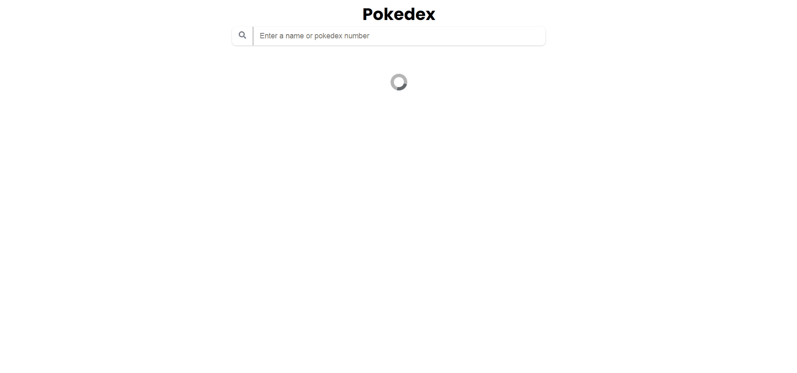

<h1 align="center"> Pokedex App </h1>

<p align="center">This project is a web application to search and see pokemon informations

----

<h1 align="center">
  
</h1>

## Table of Contents

- [The Project](#the-project)
- [Features](#features)
- [Built with](#built-with)
- [Running the Application](#running-the-application)


## The Project 

This is a project based in a challenge on [Weekly Projects](https://github.com/florinpop17/weekly-projects)'s repository from the user [florinpop17](https://github.com/florinpop17/). The repository was created as a challenge to increase coding skill.


## Features

 - [x] User can search by pokemon's name.
 - [x] User can see pokemon's type, sprite, ability, and description.
 - [x] User can see pokemon's stats with different bars.


## Built With

- [React](https://pt-br.reactjs.org/)
- [React Router Dom 6](https://reactrouter.com/)
- [styled-components](https://styled-components.com/)
- [ViteJs](https://vitejs.dev/)

## Running the Application

Yarn need to be installed to run the application

To install yarn just run:

```
npm install --global yarn
```
after that you're going to need to install the dependencies in package.json

```
yarn install
```

so finally to run

```
yarn start
```

## Author

Made by [@Otavio-Cipriano](https://github.com/Otavio-Cipriano) 🤖

<br/>
<br/>

<a href="https://www.linkedin.com/in/otaviocipriano/">

</a>
<a href="https://twitter.com/otaviodv">

</a>
